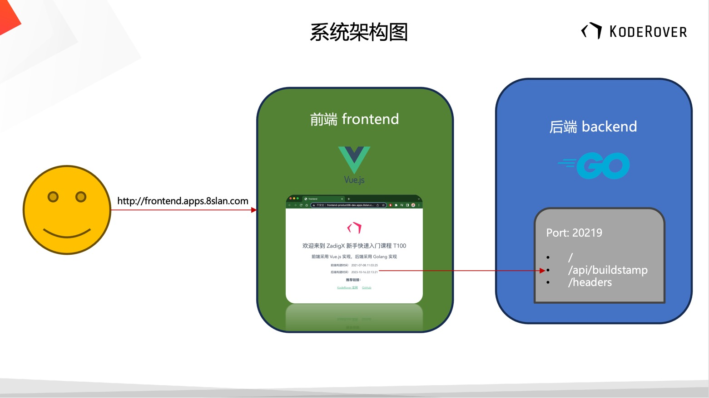

summary: ZadigX 新手快速入门课程 T100
id: t100
categories: training
environments: Web
status: Published
authors: Martin Liu
Feedback Link:  https://github.com/koderover/zadig-bootcamp/issues

# ZadigX 新手快速入门课程 T100
<!-- ------------------------ -->


## 准备环境
Duration: 2

### 概述

前提条件：

1. 已经收到了 ZadigX 团队为本培训课程注册学员提供的系统访问账号，并已经能正常登录。
2. 将示例代码 Fork 到个人账户中，为变更这套代码做好准备。
3. 在 GitLab 中创建用于代码仓库集成接入的应用认证秘钥。

### 示例应用代码

本课程基于一套可以运行的云原生微服务系统，该应用系统的架构图如下：



* 前端：只有一个页面，该页面上现实两条动态的信息：前端程序构建的时间戳，后端服务构建的时间戳（通过调用后端 /api/buildstamp 接口获得）
* 后端：运行在 20219 端口上，有几个简单的示例 api 组成。
* 前后端是松耦合的结构，前后端开发人员可以在同一套环境中各自独立开发迭代。

代码库位于：<https://gitlab.com/martinliu/zadig-training.git>

操作说明：

1. 访问并登录 [GitLab](https://gitlab.com) 个人账户。
2. 将示例代码库 Fork 到自己的账户中。

### 创建 GitLab 集成秘钥

参考文档：<https://docs.koderover.com/zadig/ZadigX%20v1.7.0/settings/codehost/gitlab/>

创建过程中需要填写 ZadigX 的回调网址：

`http://customer.8slan.com/api/directory/codehosts/callback`

创建成功的应用认证秘钥，如下图所示：


将 `Application ID` 和 `Secret` 复制在写字板中备用。

### 验收检查

1. 个人 GitLab 账户中具有 `zadigx-training` 示例代码库。
2. 创建好的 GitLab 应用集成秘钥对。

点击 NEXT 进入下一步。

<!-- ------------------------ -->
## 初始化项目
Duration: 3

### 学习目标
* 为一个多服务的产品创建研发流程中所需要的各种环境
* 配置项目运行环境，同时兼容各种 K8s 的项目风格，兼容主机（单一操作系统）的运行环境
* 创建必要的隔离不同类型工作的工作流，如 dev、qa 和 ops 等。
* 为项目集成新的产品源代码仓库

### 操作流程

用学员账号成功登录 ZadigX 系统后，既可以开始下面的操作。


1. 点击左侧的 “项目” 菜单，进入项目管理界面。
2. 点击右上角的 “新建项目” 按钮。


1. 填写项目名称
2. 填写项目描述
3. 选择 “K8s YAML 项目”，课程所使用的是这个风格的微服务系统，也支持 Helm Chart 类型；也可以接管当前已经运行这 K8s 微服务项目的 K8s 集群；同时支持基于主机运行的软件项目。
4. 点击高级配置，查看项目的高级配置选项。在制定集群中显示了当前 ZadigX 系统所对接的 K8s 集群环境，例如：用于对应开发、测试、预生产、生产等不同环境。
5. 点击 “立即新建” 按钮，开始项目初始向导。


查看 ZadigX 为本项目默认准备的初始环境和工作流，包含两套环境和三条工作流。

1. 点击 “下一步” 按钮，继续后续项目定义配置操作。


从这里开始要配置该软件所包含的各个微服务定义，课程配套代码文件夹 course-100 中的 k8s-yaml 子目录提供了所需要的服务定义描述。如果你的项目代码中没有用编写微服务定义文件，可以在这个界面中手工定义。

下面将开始接入你 Fork 到个人账户中的 zadig-training 代码库。

1. 点击这个圆形按钮
2. 开始对接目标代码库（你 GitLab 个人账户中的代码库）


1. 点击 “代码源” 的下拉菜单，你可以看到系统管理员已经接入了若干可用的代码仓库，而这些不是你个人的代码仓库。
2. 点击 “新增代码源” 按钮
3. 开始接入 GitLab 个人代码仓库


注意：这个步骤中需要使用上一节中所创建的 GitLab 应用认证秘钥对。

1. 选择 Gitlab ，你的个人代码仓库是目标源。
2. 输入 “代码源标识”
3. 输入 ‘Application ID’
4. 输入 ‘Secret’
5. 点击前往授权，页面会跳转到 GitLab 的页面，点击授权按钮后，即完成代码源系统集成操作。
6. 继续后续操作


在成功的接入了 GitLab 个人代码库之后，可以为当前项目选择使用 Fork 好的代码库。

1. 点击 ‘代码源’ 下拉菜单，选择上一步创建的新的源代码管理系统。
2. 选择自己的 GitLab 账户名
3. 选择使用我们在上一步所 Fork 的代码库 ‘zadig-training’
4. 选择分支
5. 点击选择文件夹按钮，这里是为本产品选择微服务定义描述 yaml 文件。


1. 选择正确的路径 “course-100/k8s-yaml”
2. 点击 “确定” 按钮。


1. 这里向导正确的识别除了两个微服务，如果实际项目代码中，不是所有微服务定义文件都在一个文件夹中，则需要重复本步骤，依次添加其他所有服务。
2. 点击 “同步” 按钮，ZadigX 将批量导入这些微服务定义。


1. 点击 backend 服务名称，查看相关定义文件
2. 点击 frontend 服务名称，确认相关定义文件
3. 点击 “下一步” 按钮


1. 为本产品的两个服务配置开发环境，包括：构建、运行、测试等活动所需要使用的 k8s 集群，容器镜像仓库等。
2. 在服务列表中，由于当前的镜像仓库中，曾经构建过名为 ‘backend’ 和 ‘frontend’ 服务的镜像，因此下拉菜单中有镜像名称，否则此处为空。
3. 着这里输入当前所使用的 ZadigX 培训环境的访问入口域名 ‘apps.8slan.com’
4. 点击 “创建环境”


1. 这个区域显示创建成功
2. 点击 “下一步”


1. 在这个区域中显示了 ZadigX 为当前产品项目所创建的默认工作流，它们具有很好的通用性，可以适用于大多数产品开发。也可以根据需要选择 ZadigX 内置的复杂标准工作流，或者定义企业所需要的工作流。
2. 点击 “完成”

### 验收检查

在项目管理界面中点击刚刚创建的项目。在环境信息表格中，dev 和 qa 的环境状态为 ‘正常运行’； 在项目中浏览各个菜单页面，包括：工作流、环境、服务、构建等等。

<!-- ------------------------ -->
## 定义代码构建
Duration: 5

To include code snippets you can do a few things. 
- Inline highlighting can be done using the tiny tick mark on your keyboard: "`"
- Embedded code

### JavaScript

```javascript
{ 
  key1: "string", 
  key2: integer,
  key3: "string"
}
```

### Java

```java
for (statement 1; statement 2; statement 3) {
  // code block to be executed
}
```

<!-- ------------------------ -->
## 首次调试服务
Duration: 5

### 网址链接格式

同 markdown 的标准写法。

[Youtube - Halsey Playlists](https://www.youtube.com/user/iamhalsey/playlists)

### 插入图片

同 markdown 的标准写法。

[alt-text-here](assets/Puppy.JPG)

<!-- ------------------------ -->
## 修复已知 Bug
Duration: 5

访问 Codelab 官方的格式化文档说明: [Codelab Formatting Guide](https://github.com/googlecodelabs/tools/blob/master/FORMAT-GUIDE.md)


<!-- ------------------------ -->
## 管理自动化测试
Duration: 5

访问 Codelab 官方的格式化文档说明: [Codelab Formatting Guide](https://github.com/googlecodelabs/tools/blob/master/FORMAT-GUIDE.md)


<!-- ------------------------ -->
## 发布新版本
Duration: 5


<!-- ------------------------ -->
## 扩展补充练习
Duration: 5
